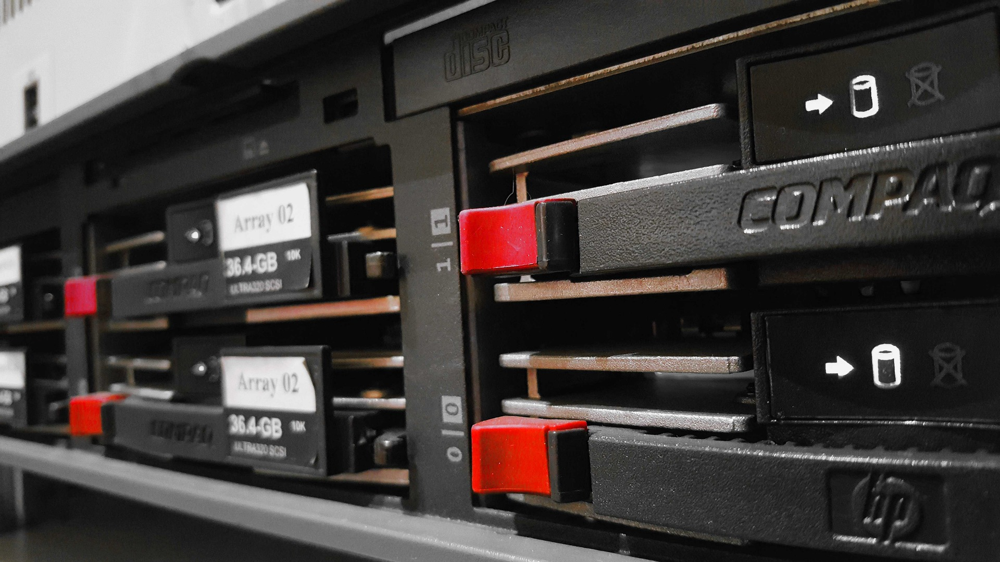

+++
title = "VPS 101: Basics, Security, and Cool Things You Can Do"
date = 2025-06-27
description = "A simple guide to understanding what a VPS is, why you might need one, and how it works behind the scenes. It also covers the essential steps to secure your server and keep your data safe. Finally, you’ll find practical ideas and examples to inspire how you can use a VPS in your own projects. Whether you’re a beginner or just need a refresher, this guide will help you get started confidently."
[extra]
featured = true
tags=["tech"]
+++

A **Virtual Private Server (VPS)** is like renting a small slice of a powerful computer in a data center. It looks and feels like your own Linux or Windows machine, but it runs on shared physical hardware.

This guide covers:

- What a VPS is
- How to set one up
- How to **harden** (secure) it
- Fun and practical things you can do

---

## What is a VPS?

- **Virtual Private:** It’s isolated—other customers can’t access your data.
- **Server:** Runs 24/7 and can host websites, apps, and services.

Compared to shared hosting, a VPS gives you:

✅ Root access  
✅ Flexibility to install anything  
✅ Better performance and isolation  

Common providers:
- DigitalOcean
- Linode
- Hetzner
- AWS Lightsail

---

## Getting Started

After ordering your VPS, you typically get:

- An **IP address** (e.g., `203.0.113.5`)
- A **root password** or SSH key login

Connect via SSH:

```bash
ssh root@203.0.113.5
```

First steps:

1. **Update packages:**

```bash
   apt update && apt upgrade
```

2. **Create a new user:**

   ```bash
   adduser myuser
   usermod -aG sudo myuser
   ```

3. **Add SSH keys:**

   ```bash
   mkdir -p /home/myuser/.ssh
   nano /home/myuser/.ssh/authorized_keys
   ```
   Paste your public key, save, and set permissions:

   ```bash
   chmod 600 /home/myuser/.ssh/authorized_keys
   chown -R myuser:myuser /home/myuser/.ssh
   ```

4. **Disable root SSH login:**

   Edit `/etc/ssh/sshd_config`:

   ```
   PermitRootLogin no
   PasswordAuthentication no
   ```

   Restart SSH:

   ```bash
   systemctl restart ssh
   ```

---

## Hardening Your VPS

Securing your server is **critical**. Here are essentials:

✅ **Firewall (UFW):**

```bash
ufw allow OpenSSH
ufw enable
```

✅ **Fail2ban (brute force protection):**

```bash
apt install fail2ban
systemctl enable fail2ban --now
```

✅ **Automatic security updates:**

```bash
apt install unattended-upgrades
dpkg-reconfigure --priority=low unattended-upgrades
```

✅ **Minimal services:**

Disable unused services:

```bash
systemctl list-unit-files --type=service
systemctl disable <service>
```

✅ **Regular backups:**

- Use `rsync` or snapshots.
- Test restoring backups periodically.

---

## Useful Things You Can Do with a VPS

Once secured, you can do all sorts of fun or productive stuff:

🎯 **Host a Website or Blog**

- Use [Nginx](https://nginx.org/) or [Caddy](https://caddyserver.com/).
- Deploy static sites (like Zola or Hugo).
- Add SSL with Let’s Encrypt.

🎯 **Run a Private Git Server**

- [Gitea](https://gitea.io/)
- [GitLab CE](https://about.gitlab.com/install/)

🎯 **Create a VPN**

- [WireGuard](https://www.wireguard.com/) is fast and easy.
- Protect your browsing on public Wi-Fi.

🎯 **Self-host Applications**

- Nextcloud (file syncing)
- Jellyfin (media server)
- Uptime Kuma (monitoring)

🎯 **Automate Tasks**

- Run cron jobs
- Host bots or scrapers
- Set up your own APIs

🎯 **Experiment & Learn**

- Try Docker, Kubernetes, Ansible
- Practice penetration testing in a safe environment

---

## Final Thoughts

Owning a VPS feels like owning a little piece of the internet.  
If you **secure it properly** and **keep it updated**, it’s an incredibly powerful tool for learning, hosting, and creating.